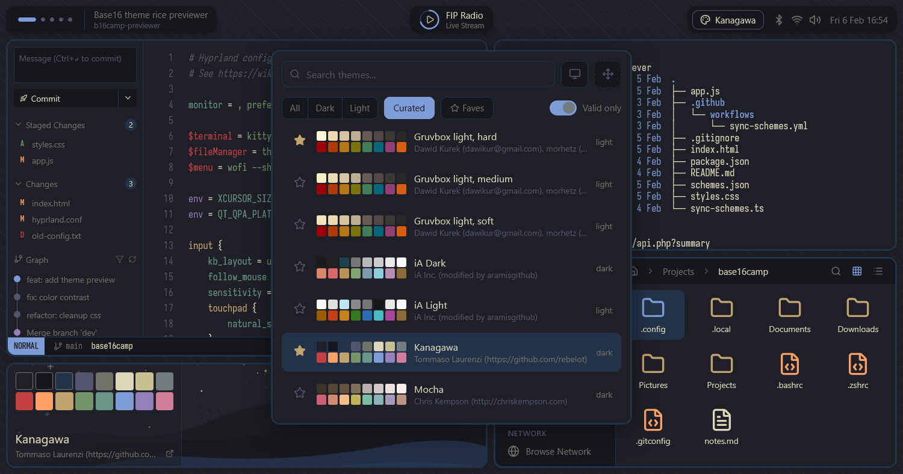

# base16camp

Preview [303 base16 schemes](https://github.com/tinted-theming/schemes) in a simulated [Hyprland](https://hyprland.org) desktop. Star favorites and compare.

**[→ View base16 previews](https://jbe.github.io/base16camp)**

No build step. Just open `index.html`. Code mostly not read by human.

---

See also: [base16 styling guidelines](https://github.com/tinted-theming/home/blob/main/styling.md) ・ [Stylix](https://github.com/danth/stylix)

*Built with vanilla JS and CSS variables by Claude Opus 4.5 and jbe.*
